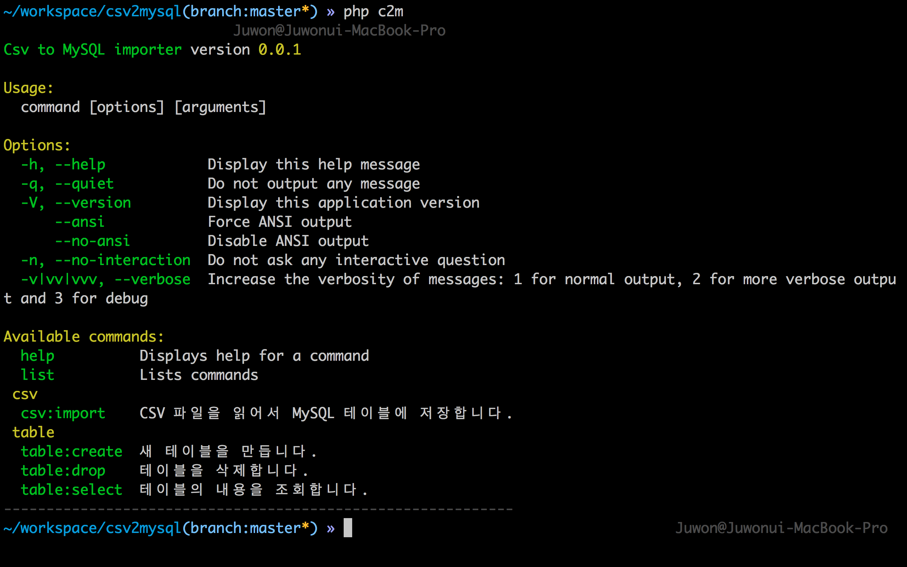
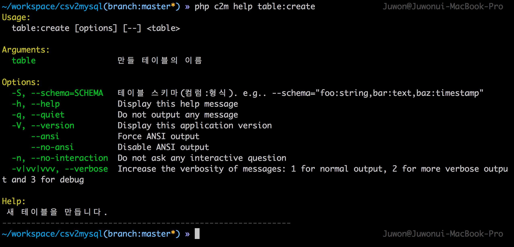
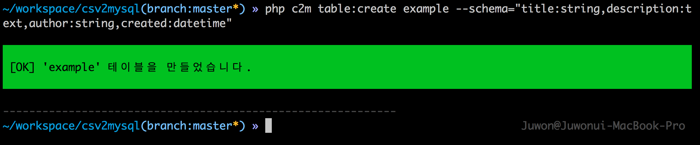
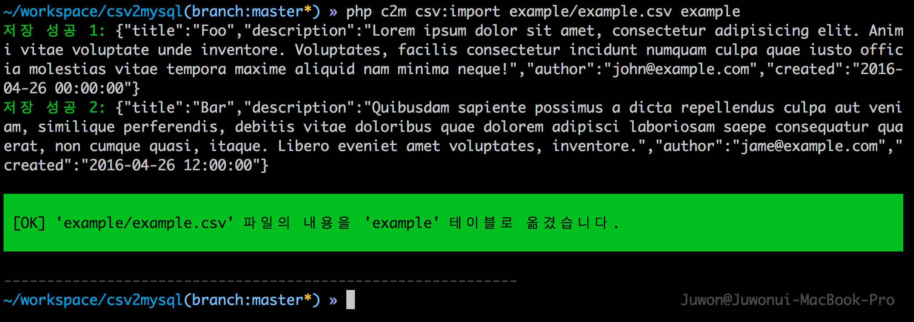
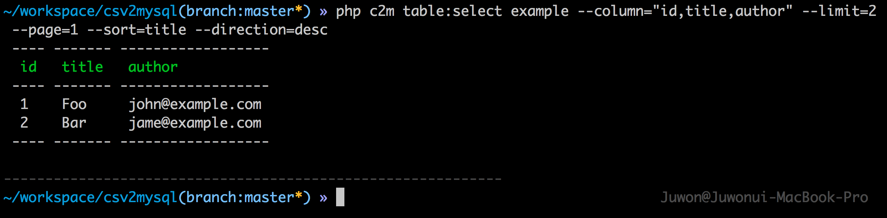
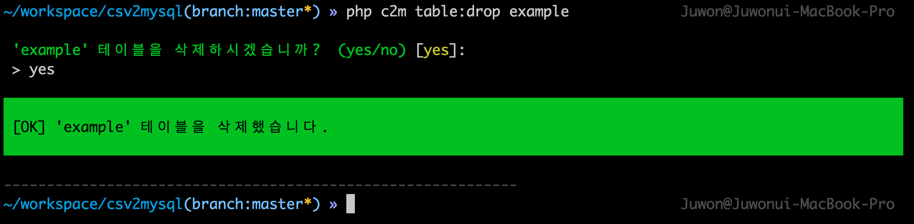

# CSV 데이터를 MySQL 테이블로 옮기는 콘솔 애플리케이션

이 프로젝트는 [디캠프](http://dcamp.kr) 주최로 총 30시간 동안 진행된 ['D.CLASS Be 개발자!'](https://www.facebook.com/groups/dclass1604) 클래스의 미니 해커톤 데이 때, 많은 학생들이 질문했던 내용에 대한 대답이다. 제목 그대로다. 데이터 때문에 더 나아가지 못하고 멈추지 말았으면 좋겠다는 생각에 후다닥 만들었다.

## 1. 설치

### 1.1. Be 개발자 수업 참여자

[다운로드](https://raw.githubusercontent.com/appkr/c2m/master/releases/c2m_0.0.1.zip) 받고 압축을 푼다(윈도우즈의 콘솔에서는 한글이 깨질 수 있다).

### 1.2. 컴포저를 아는 사용자

```sh
$ git clone git@github.com:appkr/c2m.git 
# (or git clone https://github.com/appkr/l5essential.git)
$ composer install
```

## 2. 명령어 목록

압축을 푼, 또는 클론한 디렉터리로 이동하고, `php c2m` 명령을 실행한다. 

콘솔에서 `php` 명령이 먹지 않는다면, 1) PATH 환경 변수를 설정하거나, 2) 전체 경로(예: `/Application/mamp/php/php c2m`, `C:\Bitnami\wamp\php\php c2m`)로 실행할 수도 있다.



`csv:import`, `table:create`, `table:drop`, `table:select` 명령을 각각 살펴 보기 바란다. 살펴 보는 방법은

```sh
$ cd c2m
$ php c2m help csv:import
```

처럼 `$ php c2m help 명령`을 입력하면 된다. 각 명령에 전달해야 하는 인자와 옵션을 상세히 설명하고 있다. 참고로 모든 콘솔 옵션은 `--옵션이름="옵션값"` 형식으로 쓴다.
 


## 3. 테이블 생성 명령_ `php c2m table:create 만들테이블이름 --schema=테이블스키마`

CSV 파일을 MySQL 테이블로 가져오려면, CSV 파일을 옮겨 담을 수 있는 MySQL 테이블을 먼저 만들어야 한다. 이 프로젝트에 포함된 예제에서는 CSV 파일 형식이 다음과 같다고 가정한다.

```sh
# example/example.csv 

"Title","Description","Author","Created"
"Foo","Lorem ipsum dolor sit amet, ...!","john@example.com","2016-04-26 00:00:00"
"Bar","Quibusdam sapiente possimus  ...","jame@example.com","2016-04-26 12:00:00"
```

> **CSV 사용시 주의점**
>
> 문자열 안에도 쉼표가 있을 수 있다. 그러므로, CSV의 각 값들은 모두 따옴표로 감싸야 한다. 

이제 이 CSV 데이터에 맞추어 `example` 테이블을 만든다.

```sh
$ php c2m table:create example --schema="title:string,description:text,author:string,created:datetime"
```



`--schema`옵션은 `컬럼이름:컬럼형식`으로 쓴다. 여러 개의 컬럼은 콤마(`,`)로 구분한다. 사용할 수 있는 컬럼 형식은 다음과 같다.

-   `boolean`_ MySQL의 TINYINT
-   `date`
-   `datetime`
-   `float`
-   `integer`
-   `string`_ MySQL의 VARCHAR
-   `text`
-   `timestamp`

## 4. CSV 임포트 명령_ `php c2m csv:import CSV파일경로 테이블이름`

이 프로젝트는 3번에서 봤던 `example/example.csv` 예제 파일을 포함하고 있다.

```sh
$ php c2m csv:import example/example.csv example
```



## 5. 테이블 조회_ `php c2m table:select 조회할테이블이름 --옵션들`

임포트가 잘 되었는지 확인한다.

```sh
$ php c2m table:select example
```

`table:select` 명령에서 사용할 수 있는 옵션은 다음과 같다.

-   `column`_ 조회할 컬럼을 선택한다(기본값: `*`).
-   `sort`_ 정렬 기준으로 사용할 컬럼을 선택한다(기본값: `id`).
-   `direction`_ 정렬 방향을 선택한다(기본값: `asc`).
-   `limit`_ 한번에 조회할 열 개수를 선택한다(기본값: `10`).
-   `page`_ 조회할 페이지를 선택한다(기본값: `1`).

옵션을 전부 종합한 사용 예는 다음과 같다.

```sh
$ php c2m table:select example --column="id,title,author" --limit=2 --page=1 --sort=title --direction=desc
```



## 6. 테이블 삭제_ `php c2m table:drop 삭제할테이블이름`

개발할 때는 삭제와 다시 만들기를 여러번 반복하게 되는데, 이때 이 명령을 편리하게 사용할 수 있다.

```sh
$ php c2m table:drop example
```



## 7. MySQL 접속 설정

Be 개발자 강의에 맞춰서 데이터베이스는 `opentutorials`, 사용자는 `root`, 비밀번호는 `111111`로 기본 셋팅되어있다. 이 값과 다르다면, `config/database.php`를 열어서 값을 바꾼다.

```php
// config/database.php

<?php

return [
    'driver' => 'mysql',
    'host' => 'localhost',
    'port' => '3306',
    'database' => 'opentutorials',    # 데이터베이스 이름
    'username' => 'homestead',        # MySQL 사용자 이름
    'password' => 'secret',           # MySQL 접속 비밀번호
    'charset' => 'utf8',
    'collation' => 'utf8_unicode_ci',
    'prefix' => '',
    'strict' => false,
    'engine' => 'innodb',
];
```

## 8. 라이선스

[MIT](https://github.com/appkr/csv2mysql/blob/master/LICENSE)
MIT는 LICENSE 파일의 저작자 정보를 바꾸지 않는다면, 수정, 재배포, 상업적 이용이 모두 가능한 오픈소스 라이선스다. 

Happy Coding~ \\^^/
